# AI Prompt 合集系统设计文档

## 1. 项目概述

### 1.1 项目愿景
构建一个现代化的 AI Prompt 合集平台，提供优雅的展示体验和高效的管理能力，让用户能够轻松收集、浏览和使用高质量的 AI Prompt。

### 1.2 核心价值
- **高效检索**：通过标签、分类和搜索快速定位所需 Prompt
- **优雅展示**：采用现代化设计语言，提供沉浸式的浏览体验
- **易于维护**：基于 JSON 数据驱动，便于批量管理和版本控制
- **开箱即用**：单文件 HTML 设计,无需构建工具,即刻可用

### 1.3 技术方案定位
- 纯静态站点架构（HTML + CSS + JavaScript）
- JSON 作为数据存储格式
- 支持 GitHub Pages 等静态托管平台
- 响应式设计,适配多终端设备

---

## 2. 系统架构

### 2.1 整体架构

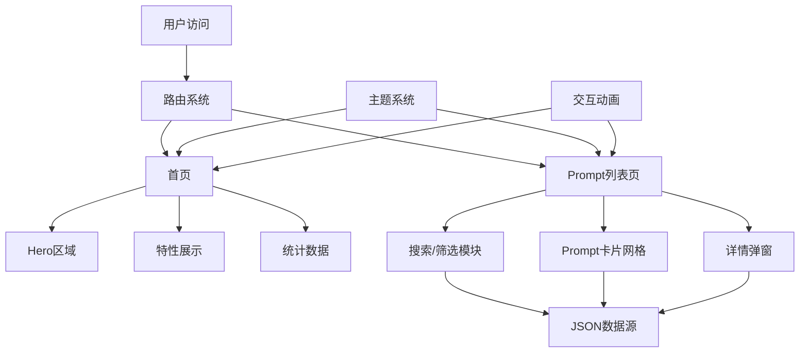

### 2.2 页面结构

| 页面 | 路由路径 | 核心功能 | 视觉重点 |
|------|---------|---------|---------|
| 首页 | `/` 或 `index.html` | 项目介绍、价值传达、快速导航 | Hero 大标题、渐变背景、统计看板 |
| 列表页 | `/prompts.html` | Prompt 展示、搜索、筛选、详情查看 | 卡片网格、搜索栏、标签云 |

### 2.3 导航系统架构

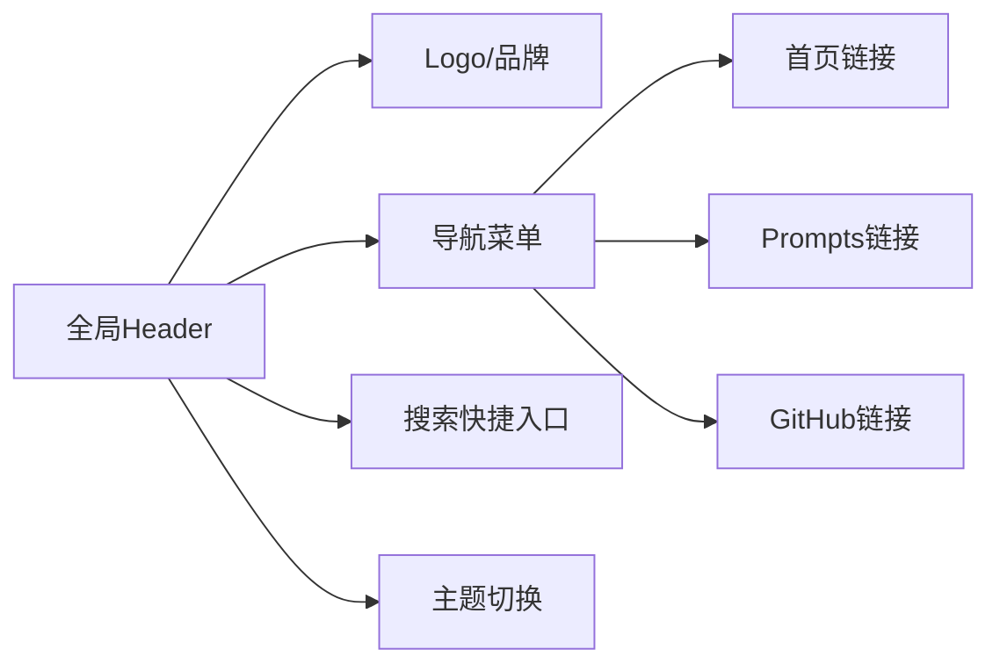

---

## 3. 数据模型设计

### 3.1 Prompt 数据结构

| 字段名称 | 数据类型 | 必填 | 说明 | 示例 |
|---------|---------|------|------|------|
| id | String | 是 | 唯一标识符 | "ui-design-001" |
| title | String | 是 | Prompt 标题 | "UI设计专家Prompt" |
| content | String | 是 | Prompt 完整内容 | "你是一位高级 UI/UX 设计师..." |
| description | String | 否 | 简短描述（用于卡片预览） | "生成现代化、极简的网页界面" |
| category | String | 是 | 分类 | "设计", "开发", "写作", "营销" |
| tags | Array<String> | 是 | 标签集合 | ["UI设计", "前端", "现代化"] |
| difficulty | String | 否 | 难度等级 | "初级", "中级", "高级" |
| createdAt | String | 是 | 创建时间（ISO 8601） | "2024-01-15T10:30:00Z" |
| updatedAt | String | 否 | 更新时间（ISO 8601） | "2024-01-20T14:20:00Z" |
| author | String | 否 | 作者名称 | "Leyen" |
| version | String | 否 | 版本号 | "1.2.0" |
| usageCount | Number | 否 | 使用次数（可选统计） | 156 |
| rating | Number | 否 | 评分（1-5） | 4.8 |
| language | String | 否 | 语言 | "zh-CN", "en-US" |
| relatedPrompts | Array<String> | 否 | 关联 Prompt ID | ["dev-001", "design-002"] |

### 3.2 数据文件结构

数据存储在 `/data/prompts.json` 文件中：

表结构描述：

| 顶层字段 | 类型 | 说明 |
|---------|------|------|
| version | String | 数据架构版本 |
| lastUpdated | String | 数据最后更新时间 |
| categories | Array<Object> | 分类元信息列表 |
| prompts | Array<Object> | Prompt 数据数组 |

分类元信息结构：

| 字段 | 类型 | 说明 |
|------|------|------|
| id | String | 分类唯一标识 |
| name | String | 分类显示名称 |
| icon | String | 分类图标（emoji 或 icon class） |
| color | String | 分类主题色（hex） |

### 3.3 数据示例模型

主数据结构：

| 字段 | 值示例 |
|------|--------|
| version | "1.0.0" |
| lastUpdated | "2024-01-20T15:30:00Z" |
| categories | [分类对象数组] |
| prompts | [Prompt对象数组] |

分类对象示例：

| 字段 | 值 |
|------|-----|
| id | "design" |
| name | "设计" |
| icon | "🎨" |
| color | "#8B5CF6" |

单个 Prompt 对象示例：

| 字段 | 值 |
|------|-----|
| id | "ui-design-expert" |
| title | "现代化 UI 设计专家" |
| description | "生成符合 Apple、Linear、Notion 风格的现代极简界面" |
| content | "你是一位高级 UI/UX 设计师和前端开发专家。请根据以下设计原则..." |
| category | "design" |
| tags | ["UI设计", "前端", "现代化", "极简"] |
| difficulty | "中级" |
| createdAt | "2024-01-15T10:30:00Z" |
| updatedAt | "2024-01-20T14:20:00Z" |
| author | "Leyen" |
| version | "1.2.0" |
| language | "zh-CN" |

---

## 4. 首页设计

### 4.1 页面结构流程

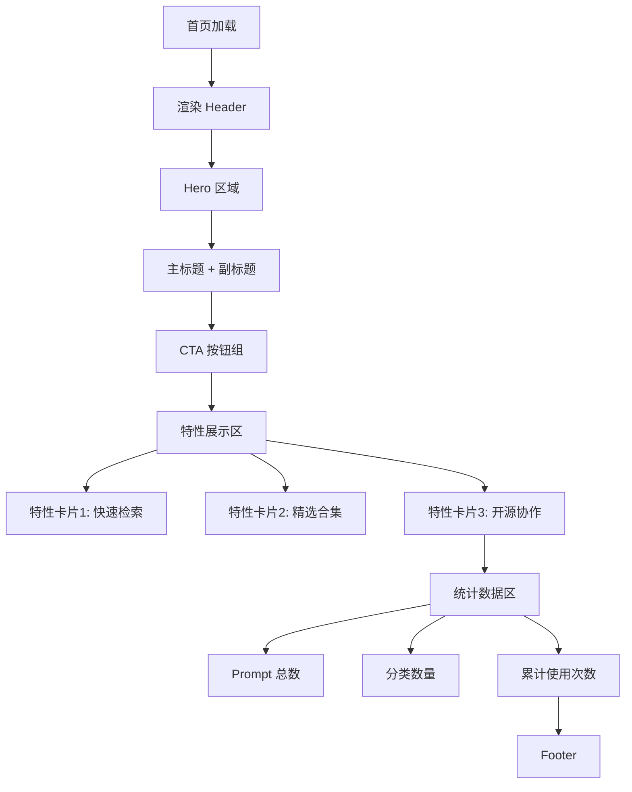

### 4.2 区域功能定义

#### Hero 区域

| 元素 | 视觉设计 | 交互行为 |
|------|---------|---------|
| 主标题 | 超大字号（64px+），渐变色文字 | 页面加载时淡入动画 |
| 副标题 | 灰色辅助文字，字号 18-20px | 延迟淡入 |
| CTA 主按钮 | 高对比度主色调按钮 | Hover 时微弹性动画，点击跳转列表页 |
| CTA 次按钮 | 描边按钮 | Hover 时填充背景色，点击跳转 GitHub |
| 装饰背景 | 网格纹理/渐变光晕/动态粒子 | 鼠标移动时视差效果 |

#### 特性展示区

采用三栏网格布局：

| 特性 | 图标 | 标题 | 描述 |
|------|------|------|------|
| 快速检索 | 🔍 | 智能搜索 | 支持标题、标签、分类的全文检索 |
| 精选合集 | ⭐ | 高质量 Prompt | 精心整理的实用 AI 提示词库 |
| 开源协作 | 🚀 | 持续更新 | GitHub 开源，欢迎贡献优质 Prompt |

每个特性卡片包含：
- 顶部图标/插画
- 粗体标题
- 辅助描述文字
- Hover 时卡片轻微上浮 + 阴影加深

#### 统计数据区

数据看板采用水平排列的卡片：

| 指标 | 数值来源 | 显示格式 |
|------|---------|---------|
| Prompt 总数 | 动态读取 JSON 数组长度 | 大号数字 + 单位文字 |
| 分类数量 | 读取 categories 长度 | 大号数字 + 单位文字 |
| 标签数量 | 统计所有 tags 去重后数量 | 大号数字 + 单位文字 |

每个统计卡片在进入视口时触发数字递增动画。

### 4.3 背景装饰设计

| 装饰元素 | 位置 | 视觉效果 | 技术实现方式 |
|---------|------|---------|------------|
| 网格纹理 | 全局背景 | 淡灰色虚线网格 | CSS Grid 或 SVG Pattern |
| 渐变光晕 | Hero 区域背后 | 紫蓝渐变模糊圆形 | CSS radial-gradient + filter blur |
| 漂浮粒子 | Hero 区域 | 缓慢移动的半透明小圆点 | CSS animation 或 Canvas |
| 光标光晕跟随 | 全局 | 鼠标位置周围的光晕效果 | JavaScript 监听 mousemove |

---

## 5. Prompt 列表页设计

### 5.1 页面布局架构

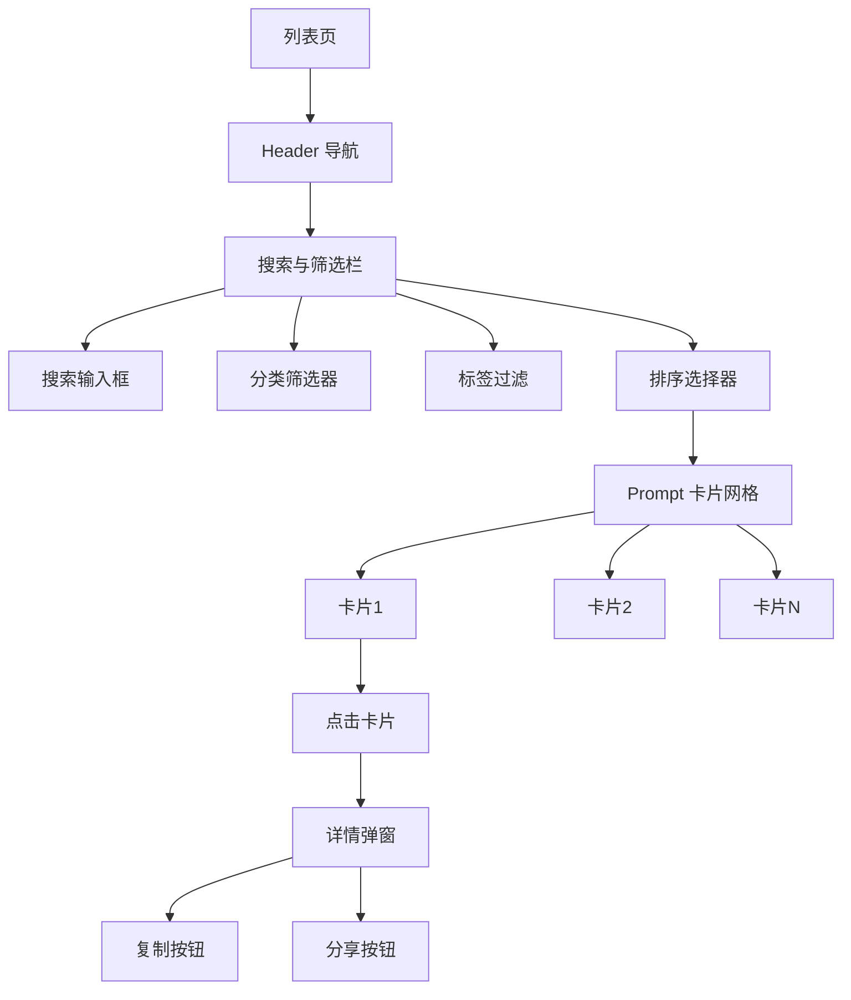

### 5.2 搜索与筛选系统

#### 搜索栏设计

| 元素 | 功能描述 | 交互反馈 |
|------|---------|---------|
| 搜索图标 | 视觉标识 | 静态显示 |
| 输入框 | 实时搜索 Prompt 标题、描述、标签 | 输入时实时过滤结果，防抖处理 |
| 快捷键提示 | 显示 "⌘K" 或 "Ctrl+K" | 全局监听快捷键，按下时聚焦搜索框 |
| 清空按钮 | 清除搜索内容 | Hover 时显示，点击清空并重置结果 |

#### 分类筛选器

以标签形式展示所有分类：

| 状态 | 视觉样式 | 行为 |
|------|---------|------|
| 全部 | 默认激活状态，高亮显示 | 点击显示所有 Prompt |
| 未选中 | 灰色描边，透明背景 | Hover 时填充背景 |
| 已选中 | 分类主题色背景，白色文字 | 点击后筛选对应分类 |

#### 标签云展示

动态显示所有标签：

| 特性 | 实现方式 |
|------|---------|
| 标签大小 | 根据使用频率调整字号（高频标签更大） |
| 标签颜色 | 继承所属分类的主题色 |
| 点击行为 | 叠加筛选（支持多标签组合） |
| 已选中状态 | 实心背景 + 移除图标 |

#### 排序选择器

| 排序方式 | 规则 |
|---------|------|
| 最新创建 | 按 createdAt 降序 |
| 最近更新 | 按 updatedAt 降序 |
| 最受欢迎 | 按 usageCount 或 rating 降序 |
| 字母顺序 | 按 title 升序 |

### 5.3 Prompt 卡片设计

#### 卡片布局结构

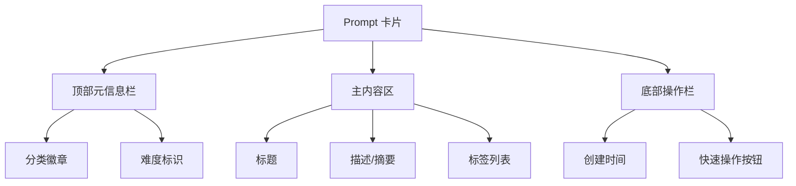

#### 卡片数据映射

| 区域 | 显示内容 | 数据来源 | 样式说明 |
|------|---------|---------|---------|
| 分类徽章 | 分类名称 + 图标 | category + categories.icon | 使用分类主题色 |
| 难度标识 | 难度等级 | difficulty | 初级/中级/高级用不同颜色 |
| 标题 | Prompt 标题 | title | 粗体，18px |
| 描述 | 简短描述 | description（截断至2-3行） | 灰色，14px |
| 标签列表 | 前3-5个标签 | tags（限制显示数量） | 小号标签，淡色背景 |
| 创建时间 | 相对时间 | createdAt（格式化为"3天前"） | 灰色小字 |
| 快速复制 | 复制图标按钮 | - | Hover 时显示 Tooltip |

#### 卡片交互状态

| 状态 | 视觉效果 | 触发条件 |
|------|---------|---------|
| 默认 | 白色背景，浅灰边框，轻微阴影 | - |
| Hover | 上浮 4px，阴影加深，边框变亮 | 鼠标悬停 |
| Active | 轻微缩小 | 鼠标按下 |
| 点击后 | 打开详情弹窗 | 点击卡片区域 |

### 5.4 详情弹窗设计

#### 弹窗结构

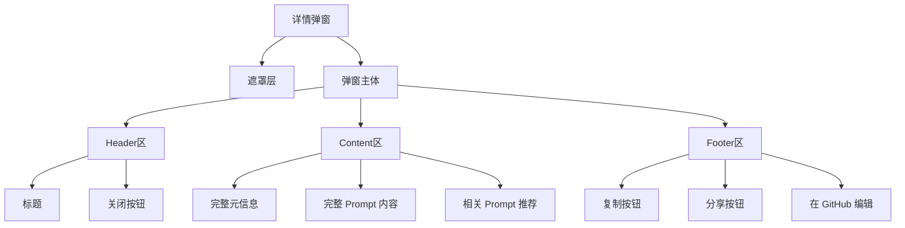

#### 弹窗功能设计

| 区域 | 内容 | 交互 |
|------|------|------|
| 元信息区 | 作者、版本、创建/更新时间、分类、难度、语言 | 静态展示，使用图标 + 文字 |
| 内容区 | 完整 Prompt 文本 | 保留换行和格式，代码块语法高亮（如有） |
| 标签区 | 所有标签 | 点击标签可快速筛选 |
| 相关推荐 | relatedPrompts 对应的卡片 | 点击跳转到对应 Prompt |
| 复制按钮 | "复制 Prompt" | 点击复制完整内容到剪贴板，按钮文字变为"已复制✓" |
| 分享按钮 | "分享" | 生成带 URL 参数的链接，支持直接定位到该 Prompt |
| GitHub 编辑 | "改进此 Prompt" | 打开对应的 GitHub 文件编辑页面 |

#### 弹窗交互行为

| 操作 | 触发方式 | 效果 |
|------|---------|------|
| 打开弹窗 | 点击卡片 | 弹窗从中心缩放淡入，背景模糊 |
| 关闭弹窗 | 点击关闭按钮/遮罩层/ESC键 | 弹窗缩放淡出 |
| 键盘导航 | Tab 键 | 在按钮间切换焦点 |
| 滚动锁定 | 弹窗打开时 | 页面主体禁止滚动 |

---

## 6. 设计系统

### 6.1 色彩系统

#### 浅色模式

| 用途 | 色值 | 应用场景 |
|------|------|---------|
| 主色调 | #8B5CF6（紫色） | CTA 按钮、链接、重点标识 |
| 辅助色 | #3B82F6（蓝色） | 次要按钮、信息提示 |
| 成功色 | #10B981（绿色） | 成功反馈、确认按钮 |
| 警告色 | #F59E0B（橙色） | 警告提示 |
| 错误色 | #EF4444（红色） | 错误提示、删除操作 |
| 背景色 | #FFFFFF | 页面主背景 |
| 次级背景 | #F9FAFB | 卡片、输入框背景 |
| 边框色 | #E5E7EB | 分割线、卡片边框 |
| 文字主色 | #111827 | 标题、正文 |
| 文字辅助色 | #6B7280 | 次要信息、描述文字 |
| 文字禁用色 | #9CA3AF | 禁用状态文字 |

#### 暗色模式

| 用途 | 色值 | 应用场景 |
|------|------|---------|
| 主色调 | #A78BFA（浅紫） | 保持品牌一致性 |
| 辅助色 | #60A5FA（浅蓝） | 次要交互元素 |
| 背景色 | #0F172A | 页面主背景 |
| 次级背景 | #1E293B | 卡片、输入框背景 |
| 边框色 | #334155 | 分割线、卡片边框 |
| 文字主色 | #F1F5F9 | 标题、正文 |
| 文字辅助色 | #94A3B8 | 次要信息 |
| 文字禁用色 | #64748B | 禁用状态 |

### 6.2 字体系统

| 层级 | 字号 | 行高 | 字重 | 用途 |
|------|------|------|------|------|
| H1 | 64px | 1.2 | 700 | 首页 Hero 标题 |
| H2 | 48px | 1.3 | 700 | 页面主标题 |
| H3 | 32px | 1.4 | 600 | 区域标题 |
| H4 | 24px | 1.5 | 600 | 卡片标题 |
| Body Large | 18px | 1.6 | 400 | 副标题、重点说明 |
| Body | 16px | 1.6 | 400 | 正文内容 |
| Body Small | 14px | 1.5 | 400 | 辅助信息、标签 |
| Caption | 12px | 1.4 | 400 | 时间戳、版权信息 |

字体族选择：

| 优先级 | 字体 |
|-------|------|
| 1 | Inter（西文） |
| 2 | -apple-system（Apple 设备） |
| 3 | BlinkMacSystemFont（Chrome） |
| 4 | "Segoe UI"（Windows） |
| 5 | "PingFang SC"（中文） |
| 6 | "Microsoft YaHei"（中文备用） |
| 7 | sans-serif（系统默认） |

### 6.3 间距系统

基于 8px 基准单位的间距体系：

| Token | 数值 | 用途 |
|-------|------|------|
| xs | 4px | 紧凑元素间距 |
| sm | 8px | 小间距 |
| md | 16px | 标准间距 |
| lg | 24px | 大间距 |
| xl | 32px | 区域间距 |
| 2xl | 48px | 大区域间距 |
| 3xl | 64px | 页面区块间距 |
| 4xl | 96px | 超大区块间距 |

### 6.4 圆角系统

| Token | 数值 | 应用 |
|-------|------|------|
| none | 0 | 无圆角 |
| sm | 4px | 标签、小按钮 |
| md | 8px | 按钮、输入框 |
| lg | 12px | 卡片 |
| xl | 16px | 大卡片、弹窗 |
| 2xl | 24px | 特殊装饰元素 |
| full | 9999px | 圆形按钮、徽章 |

### 6.5 阴影系统

| 层级 | CSS Shadow | 用途 |
|------|-----------|------|
| sm | 0 1px 2px rgba(0,0,0,0.05) | 输入框、小卡片 |
| md | 0 4px 6px rgba(0,0,0,0.07) | 按钮、普通卡片 |
| lg | 0 10px 15px rgba(0,0,0,0.1) | Hover 状态卡片 |
| xl | 0 20px 25px rgba(0,0,0,0.15) | 弹窗、抽屉 |
| 2xl | 0 25px 50px rgba(0,0,0,0.25) | 模态框最高层级 |

暗色模式阴影调整：不透明度降低 50%，避免过重。

### 6.6 组件状态规范

#### 按钮状态

| 状态 | 视觉变化 | 变化时长 |
|------|---------|---------|
| Default | 默认样式 | - |
| Hover | 背景色加深 10%，轻微上浮 | 150ms |
| Active | 背景色加深 20%，轻微缩小 | 100ms |
| Focus | 外轮廓高亮（outline） | 0ms |
| Disabled | 透明度 50%，禁止交互 | - |

#### 输入框状态

| 状态 | 视觉变化 |
|------|---------|
| Default | 灰色边框 |
| Focus | 主色调边框 + 外发光 |
| Error | 红色边框 + 错误提示 |
| Disabled | 灰色背景 + 禁用指针 |

#### 卡片状态

| 状态 | 视觉变化 |
|------|---------|
| Default | 标准阴影 sm |
| Hover | 阴影 lg + 上浮 4px |
| Active | 轻微缩放 0.98 |

---

## 7. 交互动画设计

### 7.1 页面加载动画

| 元素 | 动画效果 | 延迟 | 时长 |
|------|---------|------|------|
| Header | 从顶部滑入 | 0ms | 400ms |
| Hero 标题 | 淡入 + 上移 | 100ms | 600ms |
| Hero 副标题 | 淡入 + 上移 | 200ms | 600ms |
| CTA 按钮 | 淡入 + 缩放 | 300ms | 500ms |
| 特性卡片 | 依次淡入 + 上移 | 每个延迟 100ms | 500ms |
| 统计数据 | 数字递增动画 | 进入视口时触发 | 1000ms |

### 7.2 微交互动画

| 交互 | 动画描述 | 缓动函数 |
|------|---------|---------|
| 按钮 Hover | 背景色渐变 + Y 轴上移 2px | ease-out |
| 卡片 Hover | Y 轴上移 4px + 阴影过渡 | cubic-bezier(0.4, 0, 0.2, 1) |
| 标签点击 | 弹性缩放（scale 0.95 → 1.05 → 1） | spring |
| 搜索框聚焦 | 边框颜色渐变 + 宽度扩展 | ease-in-out |
| 复制成功 | 按钮文字变化 + 绿色闪烁 | ease |
| 标签添加 | 从右侧滑入 | ease-out |
| 标签移除 | 缩小淡出 | ease-in |

### 7.3 弹窗动画

| 阶段 | 效果 | 时长 |
|------|------|------|
| 进入 | 遮罩淡入 + 弹窗从中心缩放（0.9 → 1） | 300ms |
| 退出 | 遮罩淡出 + 弹窗缩小淡出 | 200ms |
| 背景模糊 | backdrop-filter: blur(8px) | 300ms |

### 7.4 过渡曲线定义

| 名称 | 贝塞尔曲线 | 使用场景 |
|------|-----------|---------|
| ease-smooth | cubic-bezier(0.4, 0, 0.2, 1) | 通用平滑过渡 |
| ease-bounce | cubic-bezier(0.68, -0.55, 0.27, 1.55) | 弹性效果 |
| ease-swift | cubic-bezier(0.55, 0, 0.1, 1) | 快速响应 |

---

## 8. 响应式设计

### 8.1 断点系统

| 设备类型 | 最小宽度 | 布局调整 |
|---------|---------|---------|
| Mobile | 0px | 单列布局，汉堡菜单 |
| Tablet | 768px | 两列卡片网格，简化导航 |
| Desktop | 1024px | 三列卡片网格，完整导航 |
| Wide Desktop | 1440px | 四列卡片网格，增加侧边距 |

### 8.2 移动端优化策略

| 优化项 | 策略 |
|-------|------|
| 导航菜单 | 折叠为汉堡菜单，侧边抽屉展开 |
| 搜索栏 | 折叠为搜索图标，点击后展开全屏搜索 |
| 卡片网格 | 单列布局，增加卡片高度 |
| 筛选器 | 折叠到下拉菜单或底部抽屉 |
| 弹窗 | 改为全屏模式 |
| 触摸优化 | 按钮最小尺寸 44x44px |
| 字体缩放 | 标题字号缩小 20-30% |

### 8.3 平板端优化

| 调整项 | 变化 |
|-------|------|
| 卡片网格 | 两列布局 |
| Hero 区域 | 标题字号适度缩减 |
| 导航栏 | 保留主要导航项，隐藏次要项 |
| 侧边栏 | 可选择性隐藏或浮动显示 |

---

## 9. 可访问性设计

### 9.1 语义化 HTML

| 元素 | HTML 标签 | 语义说明 |
|------|----------|---------|
| 页面标题 | `<h1>` | 每页仅一个 |
| 区域标题 | `<h2>` - `<h4>` | 保持层级结构 |
| 导航菜单 | `<nav>` | 包裹导航链接 |
| 主内容区 | `<main>` | 页面主要内容 |
| 卡片容器 | `<article>` | 独立内容单元 |
| 辅助信息 | `<aside>` | 侧边栏或补充内容 |
| 按钮 | `<button>` | 交互操作 |
| 链接 | `<a>` | 页面跳转 |

### 9.2 键盘导航支持

| 快捷键 | 功能 | 实现方式 |
|-------|------|---------|
| Tab | 焦点在交互元素间切换 | 确保所有按钮、链接、输入框可聚焦 |
| Enter/Space | 激活按钮或链接 | 监听 keydown 事件 |
| Esc | 关闭弹窗或重置搜索 | 全局监听 |
| ⌘K / Ctrl+K | 快速聚焦搜索框 | 全局快捷键监听 |
| 方向键 | 在卡片网格中导航 | 可选功能 |

### 9.3 屏幕阅读器支持

| 元素 | ARIA 属性 | 说明 |
|------|----------|------|
| 搜索框 | `role="search"` | 标识搜索区域 |
| 筛选器 | `aria-label="筛选 Prompt"` | 描述功能 |
| 卡片 | `aria-label="Prompt: {title}"` | 提供上下文 |
| 弹窗 | `role="dialog"`, `aria-modal="true"` | 标识模态框 |
| 复制按钮 | `aria-label="复制 Prompt 内容"` | 描述操作 |
| 加载状态 | `aria-live="polite"` | 通知状态变化 |

### 9.4 色彩对比度标准

| 文字类型 | 最小对比度 | 符合标准 |
|---------|-----------|---------|
| 正文（16px+） | 4.5:1 | WCAG AA |
| 大字（24px+） | 3:1 | WCAG AA |
| 交互元素 | 3:1 | WCAG AA |
| 目标：所有文字 | 7:1 | WCAG AAA（推荐） |

### 9.5 焦点指示器

所有交互元素在获得焦点时必须显示明确的视觉指示：

| 元素类型 | 焦点样式 |
|---------|---------|
| 按钮 | 2px 主色调外轮廓 + 4px 偏移 |
| 输入框 | 主色调边框 + 外发光 |
| 链接 | 下划线 + 颜色加深 |
| 卡片 | 边框高亮 + 阴影加强 |

---

## 10. 主题系统设计

### 10.1 主题切换机制

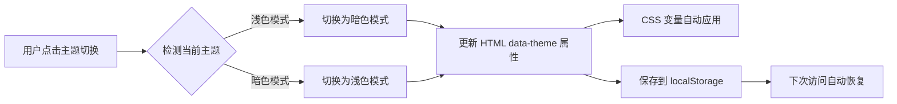

### 10.2 主题存储策略

| 存储方式 | 键名 | 值 | 优先级 |
|---------|------|-----|--------|
| localStorage | `theme` | `light` / `dark` | 1 |
| 系统偏好 | - | `prefers-color-scheme` | 2 |
| 默认值 | - | `light` | 3 |

### 10.3 CSS 变量管理

所有颜色通过 CSS 变量定义：

浅色模式变量表：

| 变量名 | 值 |
|-------|-----|
| --color-primary | #8B5CF6 |
| --color-bg | #FFFFFF |
| --color-text | #111827 |
| --color-border | #E5E7EB |

暗色模式变量表：

| 变量名 | 值 |
|-------|-----|
| --color-primary | #A78BFA |
| --color-bg | #0F172A |
| --color-text | #F1F5F9 |
| --color-border | #334155 |

主题切换时通过修改 HTML 根元素的 `data-theme` 属性，自动应用对应的 CSS 变量。

---

## 11. 性能优化策略

### 11.1 加载性能优化

| 策略 | 实现方式 | 预期收益 |
|------|---------|---------|
| 首屏内容优先 | 关键 CSS 内联，非关键 CSS 延迟加载 | 减少首屏渲染时间 |
| 图片懒加载 | 使用 Intersection Observer API | 减少初始加载数据量 |
| 字体优化 | font-display: swap | 避免文字闪烁 |
| 压缩资源 | HTML/CSS/JS minify | 减少文件大小 30-50% |
| Gzip/Brotli | 服务器配置 | 减少传输大小 70-80% |

### 11.2 运行时性能优化

| 优化项 | 方案 |
|-------|------|
| 搜索防抖 | 用户停止输入 300ms 后执行搜索 |
| 虚拟滚动 | 大量 Prompt 时仅渲染可视区域（可选） |
| 事件委托 | 卡片点击事件绑定到父容器 |
| 动画性能 | 优先使用 transform 和 opacity，避免触发重排 |
| 避免内存泄漏 | 弹窗关闭时清理事件监听器 |

### 11.3 数据缓存策略

| 缓存内容 | 缓存位置 | 缓存时长 |
|---------|---------|---------|
| Prompt JSON 数据 | 浏览器内存 | 页面会话期间 |
| 搜索结果 | 临时变量 | 用户操作期间 |
| 用户筛选偏好 | localStorage | 永久保存 |
| 主题设置 | localStorage | 永久保存 |

---

## 12. 搜索与筛选算法

### 12.1 搜索匹配逻辑

搜索匹配流程：

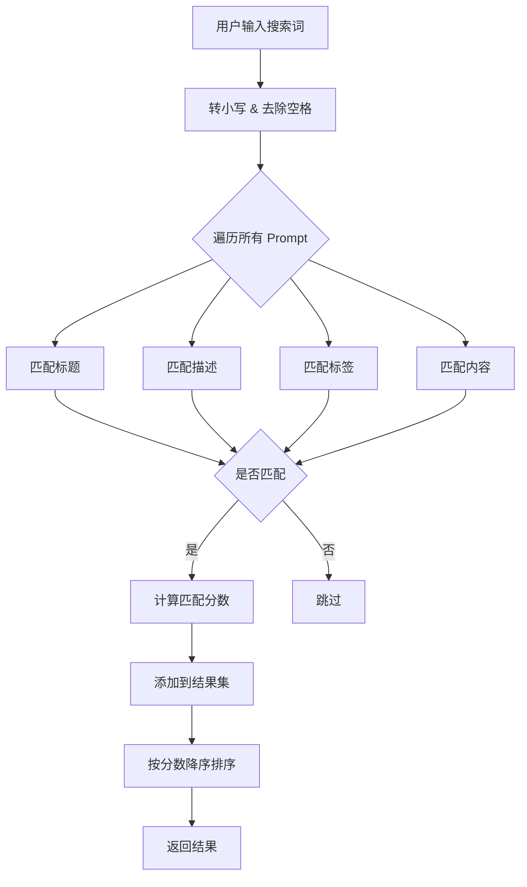

### 12.2 匹配权重设计

| 匹配位置 | 权重 | 说明 |
|---------|------|------|
| 标题完全匹配 | 100 | 最高优先级 |
| 标题部分匹配 | 80 | 标题包含搜索词 |
| 标签完全匹配 | 60 | 标签与搜索词一致 |
| 描述匹配 | 40 | 描述中包含搜索词 |
| 内容匹配 | 20 | 完整内容中包含搜索词 |

### 12.3 筛选逻辑

多条件筛选采用 AND 逻辑：

| 筛选条件 | 逻辑 | 示例 |
|---------|------|------|
| 分类筛选 | 精确匹配 | category === "design" |
| 标签筛选 | 包含任一选中标签 | tags.includes(selectedTag) |
| 难度筛选 | 精确匹配 | difficulty === "中级" |
| 组合筛选 | 所有条件同时满足 | 分类 AND 标签 AND 难度 |

---

## 13. URL 路由与分享设计

### 13.1 URL 参数设计

| 参数名 | 类型 | 说明 | 示例 |
|-------|------|------|------|
| id | String | Prompt 唯一标识 | `?id=ui-design-expert` |
| search | String | 搜索关键词 | `?search=设计` |
| category | String | 分类筛选 | `?category=design` |
| tags | String | 标签筛选（逗号分隔） | `?tags=UI设计,前端` |
| sort | String | 排序方式 | `?sort=latest` |

### 13.2 分享功能实现

点击分享按钮时生成的 URL 格式：

| 分享场景 | URL 格式 | 行为 |
|---------|---------|------|
| 分享特定 Prompt | `https://domain.com/prompts.html?id=xxx` | 打开列表页并自动弹出该 Prompt 详情 |
| 分享搜索结果 | `https://domain.com/prompts.html?search=xxx` | 打开列表页并自动执行搜索 |
| 分享筛选结果 | `https://domain.com/prompts.html?category=xxx&tags=yyy` | 打开列表页并自动应用筛选 |

### 13.3 页面初始化流程

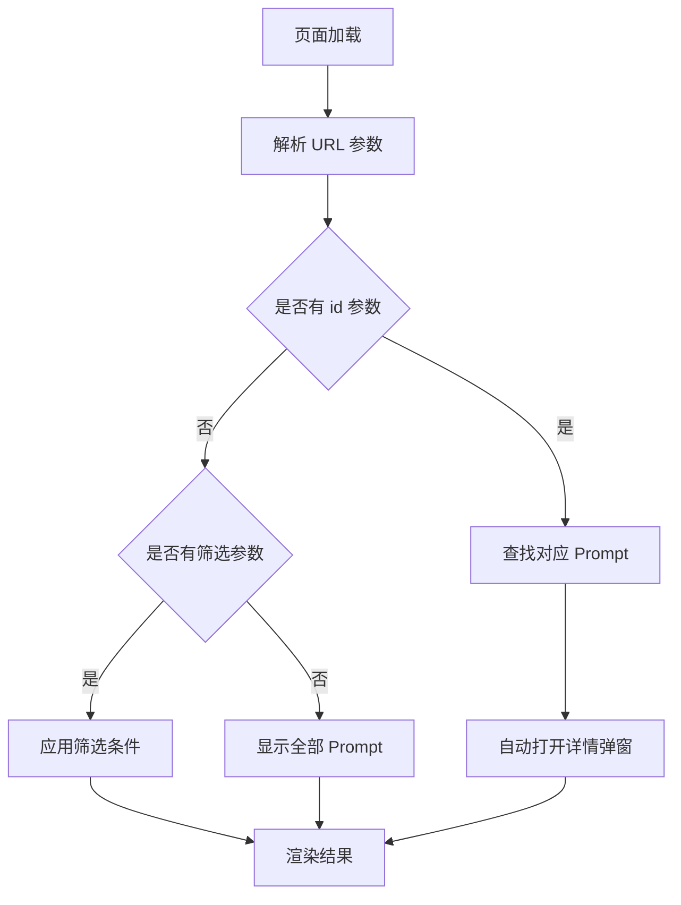

---

## 14. 数据维护工作流

### 14.1 添加新 Prompt 流程


### 14.2 Prompt 数据验证规则

| 字段 | 验证规则 |
|------|---------|
| id | 必填，唯一，仅包含小写字母、数字、连字符 |
| title | 必填，长度 5-100 字符 |
| content | 必填，长度 20-10000 字符 |
| category | 必填，必须在 categories 列表中 |
| tags | 必填，数组长度 1-10 |
| createdAt | 必填，符合 ISO 8601 格式 |
| difficulty | 可选，必须为"初级"/"中级"/"高级"之一 |

### 14.3 批量管理建议

| 操作 | 工具/方式 |
|------|----------|
| 批量导入 | 编写 JSON 转换脚本 |
| 批量修改标签 | 使用 jq 或 Python 脚本 |
| 数据备份 | Git 版本控制 + 定期导出 |
| 数据迁移 | 保持 JSON Schema 一致性 |

---

## 15. 扩展功能设计（可选）

### 15.1 收藏功能

| 特性 | 实现方式 |
|------|---------|
| 收藏按钮 | 每个 Prompt 卡片和详情页显示心形图标 |
| 状态切换 | 点击切换收藏/取消收藏，图标填充/空心切换 |
| 数据存储 | localStorage 保存收藏的 Prompt ID 数组 |
| 筛选显示 | 导航栏添加"我的收藏"入口，筛选已收藏项 |

### 15.2 使用统计

| 统计项 | 记录方式 |
|-------|---------|
| 复制次数 | 每次复制时 localStorage 计数 +1 |
| 浏览次数 | 每次打开详情时计数 +1 |
| 热门排行 | 根据复制次数排序 |

### 15.3 评分与反馈

| 功能 | 设计方案 |
|------|---------|
| 评分系统 | 详情页显示 5 星评分，数据存储在 JSON 或 localStorage |
| 反馈入口 | "报告问题"按钮，跳转到 GitHub Issues 并自动填充模板 |

### 15.4 多语言支持

| 实现方案 | 说明 |
|---------|------|
| UI 翻译 | 使用 i18n 库，支持中英文切换 |
| Prompt 语言筛选 | 根据 language 字段筛选不同语言的 Prompt |
| URL 参数 | `?lang=en` 控制界面语言 |

---

## 16. 部署与发布

### 16.1 托管平台选择

| 平台 | 优势 | 适用场景 |
|------|------|---------|
| GitHub Pages | 免费、自动部署、自定义域名 | 开源项目首选 |
| Vercel | 极速部署、边缘网络、自动 HTTPS | 追求性能 |
| Netlify | 表单支持、重定向规则、A/B 测试 | 需要额外功能 |
| Cloudflare Pages | 全球 CDN、无限带宽 | 高流量场景 |

### 16.2 部署配置建议

| 配置项 | 推荐值 | 说明 |
|-------|--------|------|
| 自定义域名 | prompts.yourdomain.com | 提升品牌形象 |
| HTTPS | 强制启用 | 安全性和 SEO |
| CDN | 启用 | 加速全球访问 |
| 缓存策略 | HTML: no-cache, CSS/JS: 1年 | 平衡更新与性能 |

### 16.3 CI/CD 工作流

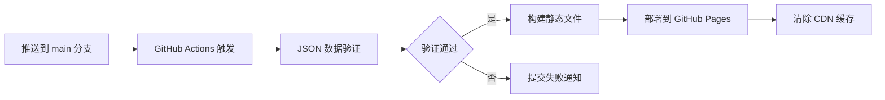

---

## 17. 测试策略

### 17.1 功能测试清单

| 测试项 | 测试场景 |
|-------|---------|
| 搜索功能 | 输入关键词、特殊字符、空字符，验证结果准确性 |
| 筛选功能 | 单一筛选、组合筛选、清空筛选 |
| 排序功能 | 切换不同排序方式，验证结果顺序 |
| 详情弹窗 | 打开、关闭、键盘操作、点击遮罩 |
| 复制功能 | 点击复制按钮，验证剪贴板内容 |
| 主题切换 | 切换主题，刷新页面验证持久化 |
| URL 分享 | 生成分享链接，验证参数解析和页面状态 |

### 17.2 兼容性测试

| 测试维度 | 测试范围 |
|---------|---------|
| 浏览器 | Chrome 90+, Firefox 88+, Safari 14+, Edge 90+ |
| 设备 | iPhone, iPad, Android 手机/平板, 桌面端 |
| 屏幕尺寸 | 320px, 768px, 1024px, 1440px, 1920px |
| 操作系统 | Windows, macOS, iOS, Android |

### 17.3 性能测试指标

| 指标 | 目标值 | 测量工具 |
|------|--------|---------|
| 首屏加载时间 | < 1.5s | Lighthouse |
| 首次内容绘制（FCP） | < 1.0s | Lighthouse |
| 最大内容绘制（LCP） | < 2.5s | Lighthouse |
| 首次输入延迟（FID） | < 100ms | Lighthouse |
| 累积布局偏移（CLS） | < 0.1 | Lighthouse |
| 性能评分 | > 90 | Lighthouse |

### 17.4 可访问性测试

| 测试项 | 工具 |
|-------|------|
| 色彩对比度 | Chrome DevTools Contrast Checker |
| 键盘导航 | 手动测试 |
| 屏幕阅读器 | NVDA (Windows) / VoiceOver (macOS) |
| ARIA 属性 | axe DevTools |
| 语义化 HTML | HTML Validator |

---

## 18. 视觉设计参考

### 18.1 参考网站

| 网站 | 借鉴元素 | URL |
|------|---------|-----|
| Linear | 极简导航、柔和渐变、微动画 | linear.app |
| Vercel | 黑白极简、网格背景、精致排版 | vercel.com |
| Stripe | 插画风格、流畅动画、信息层次 | stripe.com |
| Notion | 卡片设计、标签系统、侧边栏 | notion.so |
| Tailwind UI | 组件一致性、色彩系统 | tailwindui.com |

### 18.2 设计关键词

- 现代极简（Modern Minimalism）
- 克制美学（Restrained Aesthetics）
- 呼吸感留白（Breathing Space）
- 柔和渐变（Soft Gradients）
- 微妙阴影（Subtle Shadows）
- 流畅动画（Smooth Animations）
- 科技感装饰（Tech-inspired Decorations）
- 玻璃态射（Glassmorphism）

---

## 19. 项目文件结构

```
prompt/
├── index.html                 # 首页
├── prompts.html              # Prompt 列表页
├── data/
│   └── prompts.json          # Prompt 数据文件
├── assets/
│   ├── styles/
│   │   ├── global.css        # 全局样式和 CSS 变量
│   │   ├── components.css    # 组件样式
│   │   └── animations.css    # 动画定义
│   ├── scripts/
│   │   ├── main.js           # 公共逻辑（主题切换、导航）
│   │   ├── home.js           # 首页逻辑
│   │   └── prompts.js        # 列表页逻辑（搜索、筛选、弹窗）
│   └── images/
│       ├── logo.svg          # Logo
│       └── decorations/      # 装饰图形
├── ui.md                     # 原有的 UI 设计指南（可保留作为文档）
└── README.md                 # 项目说明文档
```

### 文件职责说明

| 文件 | 职责 |
|------|------|
| index.html | 首页结构和内容 |
| prompts.html | 列表页结构和内容 |
| prompts.json | 所有 Prompt 数据存储 |
| global.css | CSS 变量、重置样式、全局布局 |
| components.css | 按钮、卡片、输入框等组件样式 |
| animations.css | 所有动画和过渡效果 |
| main.js | 主题切换、导航交互、工具函数 |
| home.js | 首页特有逻辑（统计数据动画等） |
| prompts.js | 列表页核心逻辑（数据加载、搜索、筛选、弹窗） |

---

## 20. 核心交互流程图

### 20.1 用户浏览 Prompt 流程

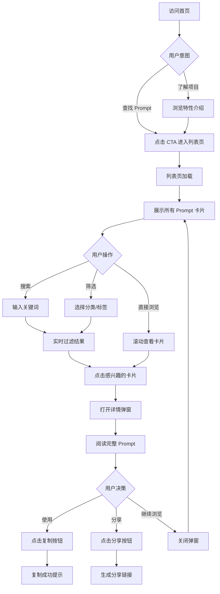

### 20.2 搜索与筛选流程

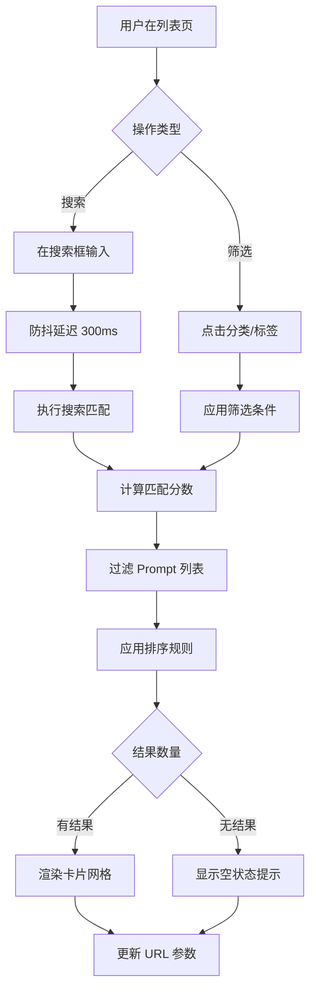

### 20.3 主题切换流程

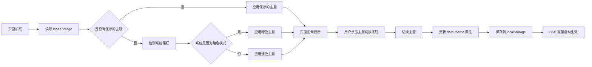

---

## 21. 技术实现要点

### 21.1 关键技术选型

| 技术 | 选择 | 理由 |
|------|------|------|
| 框架 | 无框架（Vanilla JS） | 轻量、简单、无构建依赖 |
| 样式 | 原生 CSS（CSS Variables） | 充分利用现代 CSS 特性 |
| 数据格式 | JSON | 易于编辑和版本控制 |
| 图标 | Emoji + SVG | 无需外部图标库 |
| 字体 | 系统字体栈 | 加载速度快，视觉统一 |

### 21.2 核心功能实现策略

#### 数据加载
通过 fetch API 异步加载 prompts.json，加载完成后缓存到内存变量中，避免重复请求。

#### 搜索功能
遍历所有 Prompt，对标题、描述、标签、内容进行模糊匹配，根据匹配位置计算权重分数，最后按分数降序排列结果。

#### 筛选功能
根据用户选择的分类、标签、难度等条件，使用 Array.filter() 方法过滤数据，支持多条件组合。

#### 排序功能
使用 Array.sort() 方法，根据不同排序字段（createdAt、updatedAt、usageCount 等）进行比较。

#### 弹窗管理
点击卡片时动态创建弹窗 DOM，显示完整 Prompt 信息，关闭时移除 DOM 并恢复页面滚动。

#### URL 参数同步
使用 URLSearchParams API 读取和更新 URL 参数，页面加载时解析参数并自动应用搜索/筛选条件。

#### 主题切换
通过修改 HTML 根元素的 data-theme 属性，配合 CSS 变量实现主题切换，变更后保存到 localStorage。

### 21.3 浏览器 API 使用

| API | 用途 |
|-----|------|
| Fetch API | 加载 JSON 数据 |
| localStorage | 保存主题、筛选偏好、收藏列表 |
| Clipboard API | 复制 Prompt 内容到剪贴板 |
| Intersection Observer | 图片懒加载、进入视口动画触发 |
| URLSearchParams | URL 参数解析和生成 |
| matchMedia | 检测系统主题偏好 |

---

## 22. 内容策略与 SEO

### 22.1 SEO 优化

| 优化项 | 实施方案 |
|-------|---------|
| 页面标题 | 每个页面独立的 `<title>` 标签 |
| Meta 描述 | 撰写吸引人的页面描述 |
| 语义化 HTML | 使用正确的标签层级 |
| Open Graph | 添加 OG 标签，优化社交分享卡片 |
| Sitemap | 生成 sitemap.xml |
| robots.txt | 配置搜索引擎抓取规则 |
| 结构化数据 | 使用 JSON-LD 标记 Prompt 数据 |
| 性能优化 | 提升 Core Web Vitals 指标 |

### 22.2 首页 Meta 信息建议

| 标签 | 内容示例 |
|------|---------|
| title | AI Prompt 精选合集 - 高质量 AI 提示词库 |
| description | 精心整理的 AI Prompt 合集，涵盖设计、开发、写作、营销等领域，助力提升 AI 对话效率 |
| keywords | AI Prompt, 提示词, ChatGPT, AI 对话, 人工智能 |
| og:title | AI Prompt 精选合集 |
| og:description | 高质量 AI 提示词库，快速查找和使用 |
| og:image | [预览图 URL] |

---

## 23. 后续迭代方向

### 23.1 功能增强

| 功能 | 优先级 | 复杂度 | 价值 |
|------|--------|--------|------|
| Prompt 版本历史 | 中 | 中 | 追溯演进过程 |
| 用户贡献 Prompt | 高 | 高 | 社区参与 |
| AI 辅助搜索 | 低 | 高 | 智能推荐 |
| 导出收藏为 JSON | 中 | 低 | 数据可携带 |
| Prompt 模板变量 | 中 | 中 | 提升复用性 |
| 多人协作编辑 | 低 | 高 | 协作能力 |

### 23.2 体验优化

| 优化项 | 说明 |
|-------|------|
| PWA 支持 | 添加 Service Worker，支持离线访问 |
| 快捷键系统 | 增加更多键盘快捷操作 |
| 深色模式自动切换 | 根据时间自动切换主题 |
| 动画可选关闭 | 尊重用户的无障碍偏好设置 |
| 卡片视图切换 | 提供列表视图和网格视图 |

### 23.3 技术升级

| 升级项 | 说明 |
|-------|------|
| 引入构建工具 | 如需复杂功能，可引入 Vite |
| TypeScript | 增强代码可维护性 |
| 前端框架 | 如数据复杂度提升，可考虑 Vue/React |
| 后端支持 | 添加用户系统、评论、统计分析 |
| 数据库 | 迁移到 Supabase 或 Firebase |
