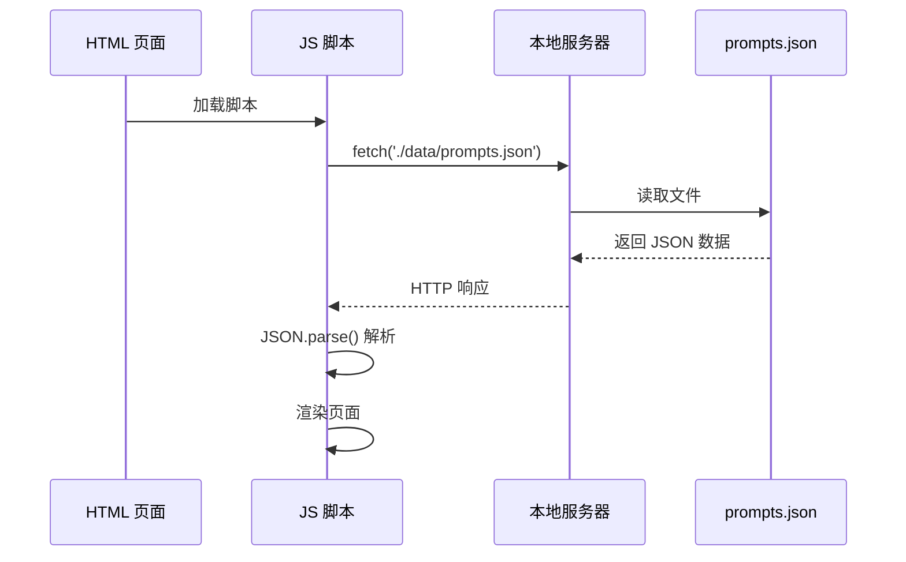
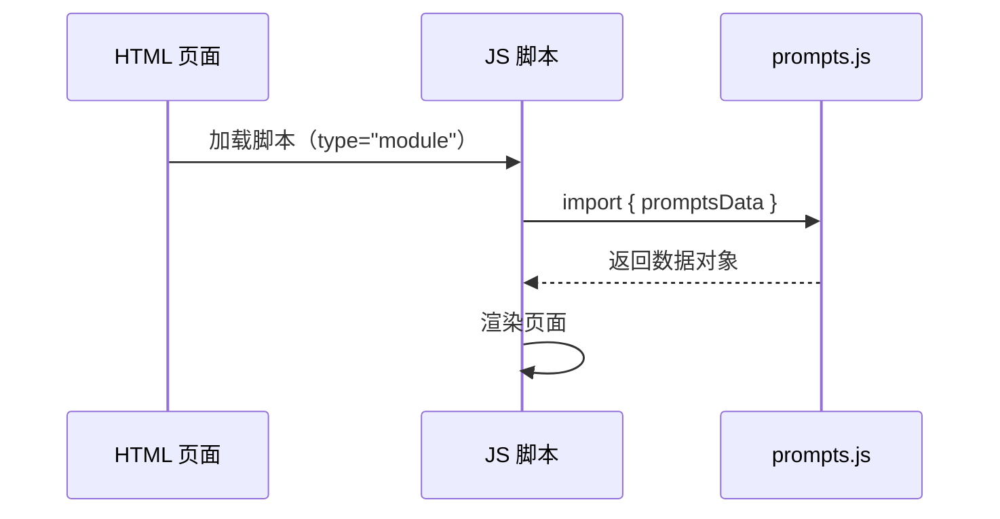
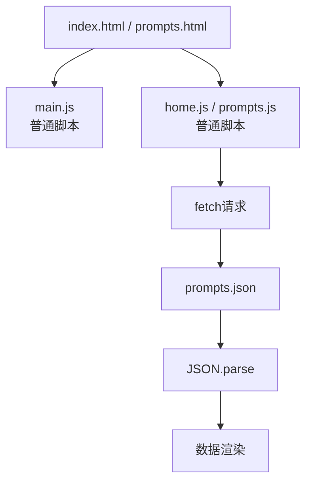
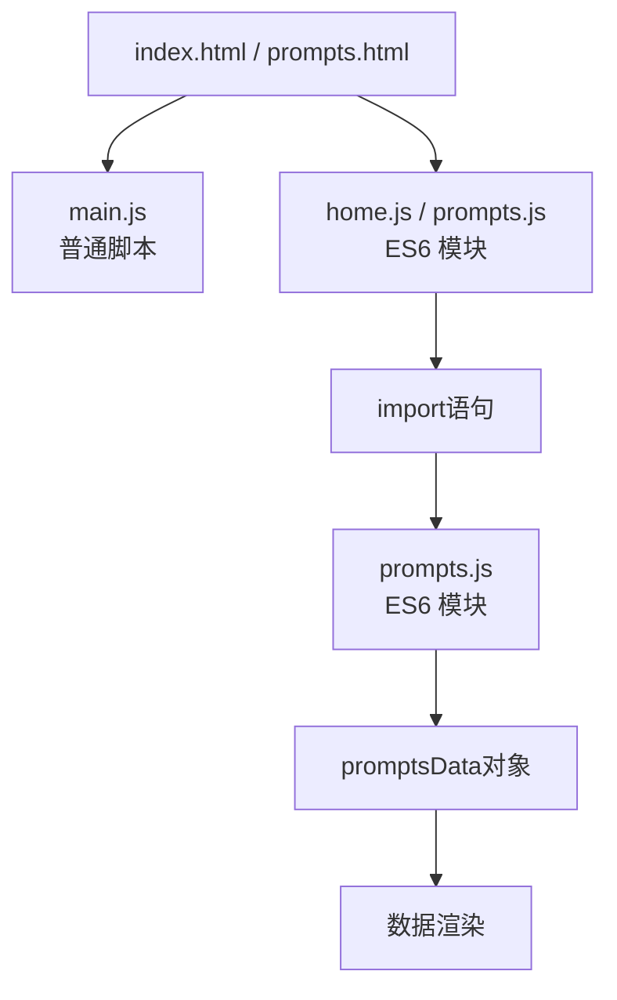

# 数据格式重构：JSON 转 JS 多行字符串

## 📋 概述

本设计旨在将 Prompt 数据存储格式从 `prompts.json` 文件迁移至 `prompts.js` 的 JavaScript 多行字符串形式，以优化内容维护体验和简化数据加载流程。

### 核心价值
- **内容维护优化**：JSON 中的多行字符串需转义换行符，维护困难；JS 模板字符串原生支持多行，维护更直观
- **加载性能提升**：消除异步 HTTP 请求，改为直接模块引用，减少网络延迟
- **开发体验改善**：无需处理 JSON 格式限制，内容编辑更自然

### 影响范围
- 数据文件：`data/prompts.json` → `data/prompts.js`
- 页面引用：`index.html`、`prompts.html`
- 脚本加载：`home.js`、`prompts.js`

---

## 🎯 设计目标

| 目标 | 说明 |
|------|------|
| 数据格式转换 | 将 JSON 数据结构转为 ES6 模块导出的 JS 对象 |
| 多行字符串优化 | 利用模板字符串（\`...\`）简化多行文本维护 |
| 消除异步加载 | 从 `fetch()` 请求改为同步的 ES6 模块导入 |
| 保持功能一致 | 确保所有现有功能正常运行，无破坏性变更 |

---

## 📊 数据结构转换策略

### 当前结构（JSON）
```
{
  "version": "1.0.0",
  "lastUpdated": "2025-10-22T10:00:00Z",
  "categories": [...],
  "prompts": [
    {
      "content": "第一行\n第二行\n第三行"
    }
  ]
}
```

### 目标结构（JavaScript）
```
export const promptsData = {
  version: "1.0.0",
  lastUpdated: "2025-10-22T10:00:00Z",
  categories: [...],
  prompts: [
    {
      content: `第一行
第二行
第三行`
    }
  ]
}
```

### 转换要点

| 维度 | JSON | JavaScript |
|------|------|------------|
| 文件扩展名 | `.json` | `.js` |
| 导出方式 | 无（数据文件） | `export const promptsData = ...` |
| 多行字符串 | 使用 `\n` 转义符 | 使用模板字符串 \`...\` |
| 引用方式 | `fetch('./data/prompts.json')` | `import { promptsData } from './data/prompts.js'` |

---

## 🔄 数据加载流程变更

### 现有流程（异步加载）



### 目标流程（同步导入）



### 流程对比

| 对比维度 | 异步加载（JSON） | 同步导入（JS） |
|----------|------------------|----------------|
| 网络请求 | 需要 | 不需要（浏览器模块缓存） |
| 解析开销 | `JSON.parse()` | 引擎直接解析 |
| 错误处理 | 需处理网络错误 | 无网络错误风险 |
| 加载时机 | 页面加载后异步 | 脚本执行时同步 |
| 代码复杂度 | `async/await` + `try/catch` | 直接 `import` |

---

## 📄 文件结构设计

### 数据文件（data/prompts.js）

#### 模块导出形式
- 使用 ES6 模块语法
- 导出单一常量对象 `promptsData`
- 保持原有数据结构字段不变

#### 数据组织
| 字段 | 类型 | 说明 | 示例 |
|------|------|------|------|
| `version` | String | 数据版本号 | `"1.0.0"` |
| `lastUpdated` | String | 最后更新时间（ISO 8601） | `"2025-10-22T10:00:00Z"` |
| `categories` | Array | 分类列表 | 见下表 |
| `prompts` | Array | Prompt 数据列表 | 见下表 |

#### 分类对象结构（categories）
| 字段 | 类型 | 必需 | 说明 |
|------|------|------|------|
| `id` | String | ✓ | 分类唯一标识 |
| `name` | String | ✓ | 分类显示名称 |
| `icon` | String | ✓ | Emoji 图标 |
| `color` | String | ✓ | 主题色（HEX） |

#### Prompt 对象结构（prompts）
| 字段 | 类型 | 必需 | 说明 |
|------|------|------|------|
| `id` | String | ✓ | Prompt 唯一标识 |
| `title` | String | ✓ | 标题 |
| `description` | String | ✓ | 简短描述 |
| `content` | String | ✓ | Prompt 完整内容（使用模板字符串） |
| `category` | String | ✓ | 所属分类 ID |
| `tags` | Array | ✓ | 标签列表 |
| `difficulty` | String | ✗ | 难度级别 |
| `createdAt` | String | ✓ | 创建时间（ISO 8601） |
| `updatedAt` | String | ✗ | 更新时间（ISO 8601） |
| `author` | String | ✗ | 作者 |
| `version` | String | ✗ | 版本号 |
| `language` | String | ✗ | 语言代码 |
| `usageCount` | Number | ✗ | 使用次数 |
| `rating` | Number | ✗ | 评分 |
| `relatedPrompts` | Array | ✗ | 相关 Prompt ID 列表 |

---

## 🔧 脚本改造设计

### home.js 改造

#### 改造前
| 模块 | 方法 | 实现 |
|------|------|------|
| 数据加载 | `loadData()` | `async` 函数，使用 `fetch()` |
| 错误处理 | `try/catch` | 捕获网络异常 |

#### 改造后
| 模块 | 方法 | 实现 |
|------|------|------|
| 数据导入 | 顶层 `import` | 直接引入模块 |
| 数据访问 | `init()` | 同步访问 `promptsData` |
| 错误处理 | 移除异步错误处理 | 模块导入失败由浏览器处理 |

#### 变更要点
- 移除 `loadData()` 异步方法
- 在文件顶部添加模块导入语句
- `init()` 方法改为同步初始化
- 直接从导入的对象读取数据

---

### prompts.js 改造

#### 改造前
| 模块 | 方法 | 实现 |
|------|------|------|
| 数据加载 | `loadData()` | `async` 函数，使用 `fetch()` |
| 初始化流程 | `init()` | `await this.loadData()` |
| 错误提示 | 网络错误 | 显示"数据加载失败" |

#### 改造后
| 模块 | 方法 | 实现 |
|------|------|------|
| 数据导入 | 顶层 `import` | 直接引入模块 |
| 初始化流程 | `init()` | 同步访问数据并初始化 |
| 错误处理 | 移除 | 模块加载失败浏览器报错 |

#### 变更要点
- 移除 `loadData()` 方法及相关错误处理
- 在文件顶部添加模块导入语句
- `init()` 改为同步方法
- 移除所有 `await` 关键字

---

## 📱 HTML 文件调整

### 脚本引入方式变更

#### index.html

**改造前**
| 位置 | 标签 | 类型 |
|------|------|------|
| `<body>` 底部 | `<script src="./assets/scripts/main.js"></script>` | 普通脚本 |
| `<body>` 底部 | `<script src="./assets/scripts/home.js"></script>` | 普通脚本 |

**改造后**
| 位置 | 标签 | 类型 | 说明 |
|------|------|------|------|
| `<body>` 底部 | `<script src="./assets/scripts/main.js"></script>` | 普通脚本 | 保持不变 |
| `<body>` 底部 | `<script src="./assets/scripts/home.js" type="module"></script>` | ES6 模块 | 添加 `type="module"` |

#### prompts.html

**改造前**
| 位置 | 标签 | 类型 |
|------|------|------|
| `<body>` 底部 | `<script src="./assets/scripts/main.js"></script>` | 普通脚本 |
| `<body>` 底部 | `<script src="./assets/scripts/prompts.js"></script>` | 普通脚本 |

**改造后**
| 位置 | 标签 | 类型 | 说明 |
|------|------|------|------|
| `<body>` 底部 | `<script src="./assets/scripts/main.js"></script>` | 普通脚本 | 保持不变 |
| `<body>` 底部 | `<script src="./assets/scripts/prompts.js" type="module"></script>` | ES6 模块 | 添加 `type="module"` |

### 关键属性说明

| 属性 | 值 | 作用 |
|------|------|------|
| `type` | `"module"` | 启用 ES6 模块支持 |
| 作用域 | 模块级 | 模块内变量不污染全局作用域 |
| 严格模式 | 自动启用 | 模块默认运行在严格模式 |
| 延迟执行 | 默认 `defer` | 模块脚本自动延迟执行 |

---

## ⚙️ 技术实现要点

### 模板字符串使用规范

#### 多行文本表示
- 使用反引号（\`）包裹内容
- 支持直接换行，无需 `\n`
- 保留原始缩进和格式

#### 特殊字符处理
| 字符 | JSON 中 | JavaScript 中 |
|------|----------|---------------|
| 反引号（\`） | 无需转义 | 需转义为 `\\\`` |
| 美元符号后接大括号（`${...}`） | 无需转义 | 需转义为 `\${...}` |
| 双引号（`"`） | 需转义为 `\"` | 无需转义 |
| 单引号（`'`） | 无需转义 | 无需转义 |
| 换行符 | `\n` | 直接换行 |

#### 示例对比
```
JSON 格式：
"content": "你是一位设计师。\n\n## 设计原则\n- 极简风格\n- 注重细节"

JavaScript 格式：
content: `你是一位设计师。

## 设计原则
- 极简风格
- 注重细节`
```

---

### 模块导入兼容性

#### 浏览器要求
| 浏览器 | 最低版本 | 支持情况 |
|--------|----------|----------|
| Chrome | 61+ | ✓ 完全支持 |
| Firefox | 60+ | ✓ 完全支持 |
| Safari | 11+ | ✓ 完全支持 |
| Edge | 16+ | ✓ 完全支持 |

#### 开发环境要求
- 必须通过 HTTP 服务器访问（`http://` 或 `https://`）
- 不支持 `file://` 协议（模块导入会被浏览器阻止）
- 项目已包含 `start.sh` 启动脚本，满足要求

---

### 作用域变更影响

#### 全局变量暴露策略

**问题**
- 模块脚本默认在模块作用域运行
- 模块内的变量不会自动挂载到 `window` 对象
- `prompts.html` 中的 `resetFilters()` 全局函数调用可能失效

**解决方案**
| 方案 | 实现 | 优缺点 |
|------|------|--------|
| 显式挂载到 window | `window.promptsPage = new PromptsPage()` | 兼容现有代码，但污染全局 |
| 事件委托 | 将 `onclick="resetFilters()"` 改为事件监听 | 更符合现代实践，需调整 HTML |

**推荐策略**
- 保持显式挂载全局变量（`window.promptsPage`）
- 保留 `resetFilters()` 全局函数声明
- 确保与现有 HTML 内联事件处理器兼容

---

## 🎨 架构演进

### 变更前架构



### 变更后架构



### 架构优势对比

| 维度 | 变更前 | 变更后 |
|------|--------|--------|
| 依赖管理 | 隐式（运行时获取） | 显式（静态导入） |
| 加载性能 | 异步请求 + 解析 | 模块缓存 + 原生解析 |
| 代码可读性 | 回调/Promise 嵌套 | 清晰的导入依赖 |
| 错误定位 | 网络错误 + 解析错误 | 模块加载错误 |
| 维护成本 | JSON 格式限制 | JavaScript 灵活性 |

---

## 🔍 功能影响分析

### 不受影响的功能

| 功能模块 | 说明 |
|----------|------|
| 搜索与筛选 | 数据结构完全一致，逻辑无需调整 |
| 分类展示 | 分类数据格式不变 |
| Prompt 卡片渲染 | 渲染逻辑依赖数据结构，不受加载方式影响 |
| 详情弹窗 | 显示逻辑与数据源无关 |
| 排序功能 | 依赖数据字段，不受影响 |
| 主题切换 | 独立模块，无数据依赖 |
| 统计数据动画 | 基于数据计算，不受影响 |

### 需调整的代码

| 文件 | 调整内容 | 影响范围 |
|------|----------|----------|
| `data/prompts.json` | 转换为 `prompts.js` ES6 模块 | 数据文件 |
| `assets/scripts/home.js` | 移除 `loadData()`，改用 `import` | 数据加载逻辑 |
| `assets/scripts/prompts.js` | 移除 `loadData()`，改用 `import` | 数据加载逻辑 |
| `index.html` | `home.js` 添加 `type="module"` | 脚本引用 |
| `prompts.html` | `prompts.js` 添加 `type="module"` | 脚本引用 |

---

## 🧪 验证策略

### 功能验证清单

#### 首页（index.html）
- [ ] 统计数据正确显示（Prompts 总数、分类数、标签数）
- [ ] 数字递增动画正常执行
- [ ] 主题切换功能正常
- [ ] 页面加载无 JavaScript 错误

#### Prompts 页面（prompts.html）
- [ ] Prompt 列表正确渲染
- [ ] 搜索功能正常（标题、标签、描述匹配）
- [ ] 分类筛选正常
- [ ] 排序功能正常（最新创建、最近更新、最受欢迎、字母顺序）
- [ ] 点击卡片打开详情弹窗
- [ ] 复制 Prompt 功能正常
- [ ] 分享链接功能正常
- [ ] URL 参数解析正常（搜索、分类、排序、ID）
- [ ] "重置筛选" 按钮功能正常
- [ ] 空状态显示正常

### 性能验证

| 指标 | 验证方法 | 预期结果 |
|------|----------|----------|
| 首屏加载时间 | Chrome DevTools Network | 减少 1 次网络请求 |
| 数据解析时间 | Performance 面板 | 无 `JSON.parse()` 调用 |
| 模块加载 | Network 面板 | `prompts.js` 正常加载 |

### 兼容性验证

| 浏览器 | 版本 | 验证项 |
|--------|------|--------|
| Chrome | 最新版 | 全部功能 |
| Firefox | 最新版 | 全部功能 |
| Safari | 最新版 | 全部功能 |
| Edge | 最新版 | 全部功能 |

---

## 📝 实现注意事项

### 数据转换
- 保持所有字段名和数据结构不变
- 仔细处理 `content` 字段中的特殊字符（反引号、`${...}`）
- 确保多行文本的换行和缩进格式正确

### 模块导入
- 在 `home.js` 和 `prompts.js` 文件顶部添加导入语句
- 使用相对路径 `../data/prompts.js`
- 确保导入的变量名与导出的一致

### HTML 调整
- 仅在使用模块导入的脚本标签添加 `type="module"`
- `main.js` 保持普通脚本类型（不使用模块特性）

### 全局变量
- 保留 `window.promptsPage` 和 `window.resetFilters` 的全局暴露
- 确保内联事件处理器（如 `onclick="resetFilters()"`）正常工作

### 开发环境
- 必须通过 HTTP 服务器运行（使用 `start.sh` 或其他本地服务器）
- 不能直接双击打开 HTML 文件（`file://` 协议不支持模块导入）

---

## ✅ 预期收益

| 维度 | 收益描述 | 量化指标 |
|------|----------|----------|
| 维护效率 | Prompt 内容编辑更直观，无需处理换行转义 | 减少 50% 格式处理时间 |
| 加载性能 | 消除网络请求，减少加载延迟 | 减少 1 次 HTTP 请求 |
| 代码简洁性 | 移除异步加载和错误处理代码 | 减少约 20 行代码 |
| 开发体验 | 模块化依赖清晰，易于理解和维护 | 提升代码可读性 |
