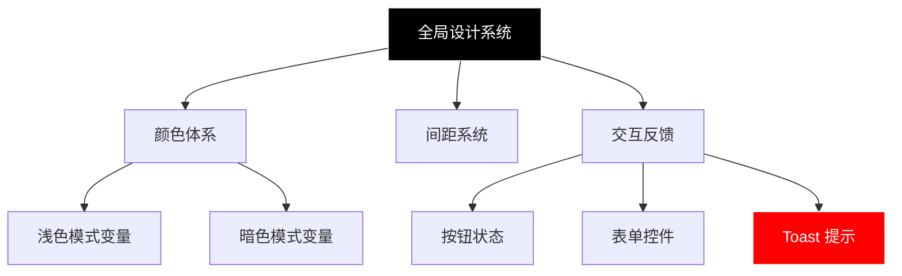
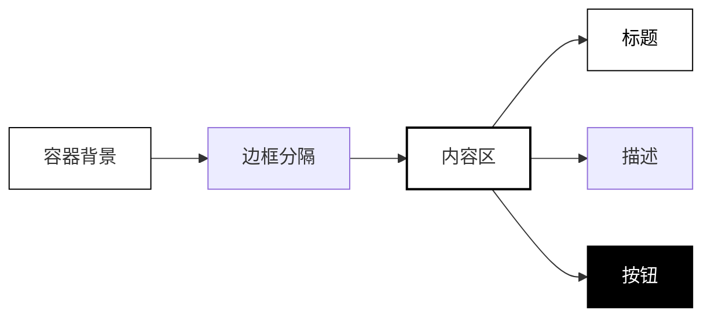
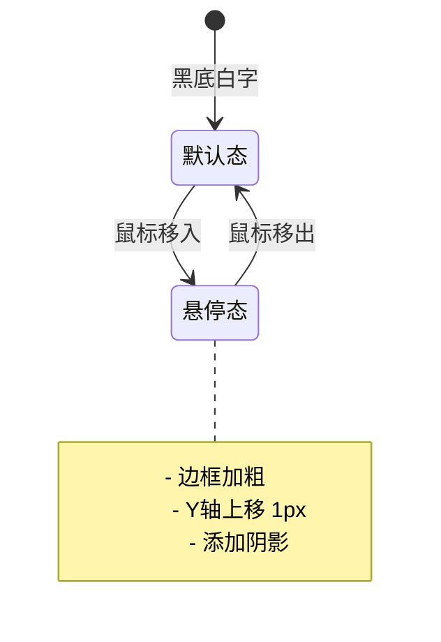
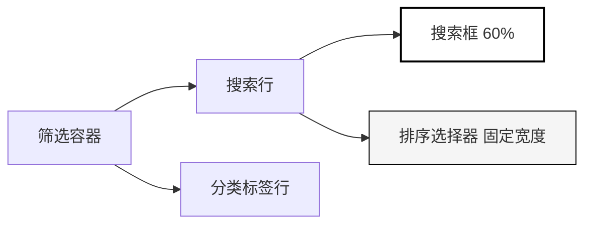
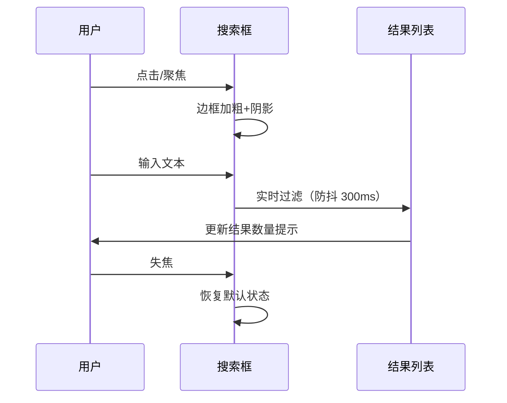
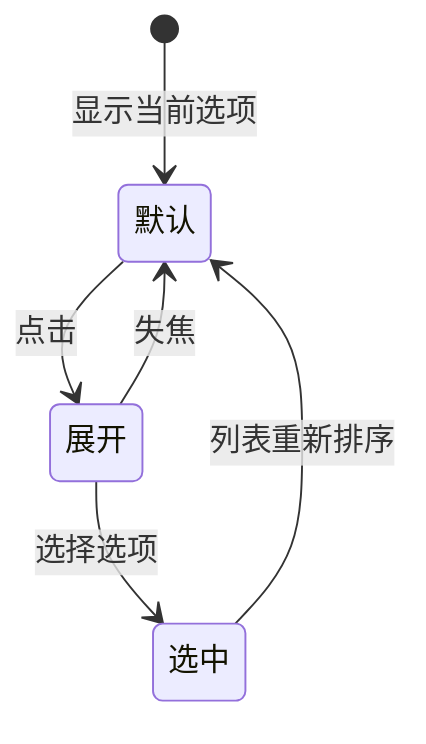
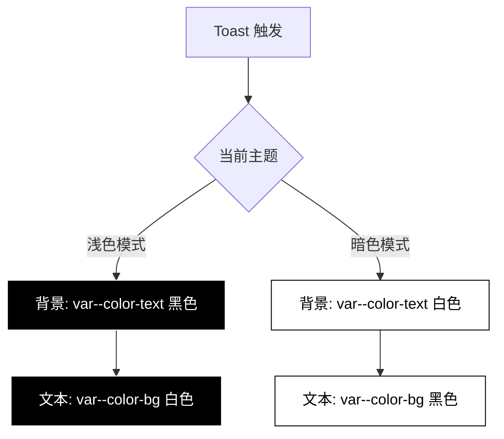

# UI 优化设计文档

## 概述

本文档针对 AI Prompt 精选合集项目的三处 UI 缺陷进行优化设计，旨在提升视觉一致性、交互体验和可用性。

**优化范围：**
1. 首页 CTA 区域视觉优化
2. Prompts 页面搜索与筛选控件优化
3. 暗色模式下 Toast 提示的可读性修复

**设计原则：**
- 极简主义：避免冗余装饰，强调功能性
- 视觉层次：通过对比度和留白建立清晰层级
- 一致性：与现有设计系统保持统一
- 可访问性：确保在所有主题模式下文本可读

---

## 架构

### 视觉系统层级



### 组件优化范围映射

| 页面 | 组件 | 问题描述 | 优化目标 |
|------|------|----------|----------|
| index.html | CTA Section | 标题与背景颜色一致、设计风格不符合预期 | 重新设计视觉层次，提升转化吸引力 |
| prompts.html | Search Box + Sort Select | 控件视觉表现不够突出，缺乏层次 | 优化表单控件设计，提升识别度 |
| 全局 | Toast 组件 | 暗色模式下文本与背景对比度不足 | 修复颜色变量映射，确保可读性 |

---

## 优化任务详细设计

### 任务一：首页 CTA 区域重设计

#### 问题分析

**当前实现：**
- CTA 区域背景使用 `var(--color-text)` 纯色填充
- 标题颜色使用 `var(--color-bg)`，在暗色模式下导致标题与背景同为黑色
- 科技感装饰（网格）与主视觉冲突
- 按钮样式与整体极简风格不够协调

**影响：**
- 浅色模式：黑底白字，但视觉过于沉重
- 暗色模式：白底黑字，标题与背景均为黑色导致不可见
- 整体视觉层次混乱，未能有效引导用户点击

#### 设计目标

构建高对比度、层次分明的 CTA 区域，确保：
1. 在所有主题模式下标题清晰可读
2. 通过视觉对比引导用户聚焦行动按钮
3. 简化装饰元素，强化功能性设计
4. 符合极简、高级感的品牌调性

#### 视觉设计方案

**方案：反色边框卡片布局**



**布局结构：**

| 元素 | 浅色模式 | 暗色模式 | 间距 |
|------|----------|----------|------|
| 区域背景 | `var(--color-bg)` 白色 | `var(--color-bg)` 黑色 | 上下各 64px |
| 内容容器 | 带 1px 边框的卡片 | 带 1px 边框的卡片 | 内边距 48px |
| 上方标签 | 小号大写文本，边框包裹 | 小号大写文本，边框包裹 | 底部 16px |
| 主标题 | 3rem 粗体，`var(--color-text)` | 3rem 粗体，`var(--color-text)` | 底部 16px |
| 描述文本 | 次要颜色，1.125rem | 次要颜色，1.125rem | 底部 32px |
| 行动按钮 | 黑底白字，大号 | 白底黑字，大号 | - |

**关键设计原则：**
- **删除背景色填充**：整个 section 使用页面默认背景色
- **边框强调**：通过边框而非背景色定义区域边界
- **文本对比**：始终保持文本使用 `var(--color-text)`，确保跟随主题切换
- **按钮反色**：按钮作为唯一重色块，形成视觉焦点

**装饰元素处理：**
- 移除科技网格背景（tech-grid）
- 保留区域顶部 1px 边框作为分隔
- 使用负空间（留白）代替复杂装饰

#### 交互反馈设计

**按钮悬停状态：**



| 状态 | 背景 | 文本 | 边框 | 变换 |
|------|------|------|------|------|
| 默认 | `var(--color-text)` | `var(--color-bg)` | 1px solid | - |
| 悬停 | `var(--color-text)` | `var(--color-bg)` | 1px solid + 外阴影 | translateY(-1px) |
| 按下 | `var(--color-primary-hover)` | `var(--color-bg)` | 1px solid | translateY(0) |

---

### 任务二：Prompts 页面控件优化

#### 问题分析

**当前实现：**
- 搜索框和排序选择框在同一行，视觉权重接近
- 排序下拉框样式过于轻量，易被忽略
- 搜索框占满剩余空间（flex: 1），但缺乏明确的视觉边界强化

**影响：**
- 用户难以快速识别筛选功能入口
- 控件之间缺乏层次区分
- 在大屏幕上搜索框过宽，影响视觉平衡

#### 设计目标

1. 强化搜索框作为主要交互入口的视觉权重
2. 优化排序选择器的可识别度
3. 建立清晰的控件组合层级
4. 保持极简风格，避免过度装饰

#### 视觉设计方案

**布局优化：**



**控件规格表：**

| 控件 | 宽度策略 | 高度 | 边框 | 背景 |
|------|----------|------|------|------|
| 搜索框 | flex: 1，最大 600px | 44px | 1px solid `var(--color-border-strong)` | `var(--color-bg)` |
| 排序选择器 | 固定 180px | 44px | 1px solid `var(--color-border-strong)` | `var(--color-bg-secondary)` |

**搜索框强化设计：**

1. **边框加粗**：默认状态使用 `border-strong` 而非普通 `border`
2. **图标对比**：搜索图标使用 `var(--color-text)` 而非 tertiary
3. **焦点状态**：
   - 边框变为纯黑/纯白
   - 添加 2px 外阴影（光晕效果）
   - 背景微调至 `var(--color-bg-secondary)`

**排序选择器设计：**

1. **背景区分**：默认使用 `var(--color-bg-secondary)` 与搜索框形成对比
2. **箭头图标**：在右侧添加清晰的下拉箭头符号
3. **悬停状态**：边框变为 `var(--color-text)`，背景变为 `var(--color-bg)`

#### 响应式行为

**断点处理：**

| 屏幕尺寸 | 布局策略 |
|----------|----------|
| > 768px | 搜索框和排序器同行，搜索框 flex: 1（max-width: 600px） |
| ≤ 768px | 两个控件垂直堆叠，各占 100% 宽度 |

**移动端特殊处理：**
- 搜索框快捷键提示（⌘K）隐藏
- 控件高度增加至 48px，提升触控友好度
- 间距从 16px 增至 12px

#### 微交互设计

**搜索框交互流程：**



**排序选择器交互：**



---

### 任务三：暗色模式 Toast 可读性修复

#### 问题分析

**当前实现：**

Toast 组件在 `showToast` 方法中硬编码颜色：

| 类型 | 背景色变量 | 文本色 |
|------|-----------|--------|
| success | `var(--color-success)` | white |
| error | `var(--color-error)` | white |
| 其他 | `var(--color-primary)` | white |

**问题根源：**

在 CSS 变量定义中：
- 浅色模式：`--color-success` = `#000000`（黑色）
- 暗色模式：`--color-success` = `#FFFFFF`（白色）
- 文本固定为 `white`（白色）

**结果：**
- 浅色模式：黑底白字 ✓ 可读
- 暗色模式：白底白字 ✗ 不可读

#### 设计目标

1. 确保 Toast 在所有主题模式下文本清晰可读
2. 保持与全局设计系统的颜色一致性
3. 维护现有交互行为（位置、动画、持续时间）
4. 避免引入额外的颜色变量

#### 解决方案设计

**方案：文本颜色跟随主题反色**

**颜色映射规则：**



**颜色变量对应表：**

| 主题模式 | 背景色 | 文本色 | 对比度 |
|----------|--------|--------|--------|
| 浅色 | `var(--color-text)` (#000) | `var(--color-bg)` (#FFF) | 21:1 ✓ |
| 暗色 | `var(--color-text)` (#FFF) | `var(--color-bg)` (#000) | 21:1 ✓ |

**实现策略：**

移除硬编码的颜色值，统一使用主题变量：

**修改前：**
```
background: ${type === 'success' ? 'var(--color-success)' : ...}
color: white
```

**修改后：**
```
background: var(--color-text)
color: var(--color-bg)
```

**设计理由：**
1. **语义一致性**：Toast 作为强提示，使用主题的最高对比度配色（纯黑/纯白）符合视觉逻辑
2. **维护简化**：无需为不同类型 Toast 定义独立颜色，减少变量复杂度
3. **可访问性**：确保 WCAG AAA 级对比度标准（21:1）

#### 样式规格

**Toast 视觉规格：**

| 属性 | 值 | 说明 |
|------|-----|------|
| 位置 | fixed, bottom: 24px, right: 24px | 右下角固定 |
| 背景 | `var(--color-text)` | 跟随主题反色 |
| 文本 | `var(--color-bg)` | 与背景形成最大对比 |
| 内边距 | 12px 24px | 保持紧凑 |
| 圆角 | `var(--radius-md)` | 当前为 0px（直角） |
| 阴影 | `var(--shadow-lg)` | 浮动感 |
| 字重 | 500 (Medium) | 清晰可读 |
| z-index | 10000 | 最高层级 |

**动画保持不变：**
- 入场：slideInUp（Y轴上移 + 淡入）
- 退场：slideOutDown（Y轴下移 + 淡出）
- 持续时间：默认 3000ms

#### 类型差异化（可选扩展）

当前设计删除类型颜色区分，如未来需要差异化可通过以下方式：

**方案 A：图标前缀**

| 类型 | 图标 | 示例 |
|------|------|------|
| success | ✓ | ✓ Prompt 已复制到剪贴板 |
| error | ✗ | ✗ 数据加载失败 |
| info | ℹ | ℹ 分享链接已复制 |

**方案 B：边框颜色**

保持背景和文本为黑白反色，仅在边框上添加语义颜色：
- success: 1px solid green
- error: 1px solid red

**当前阶段建议：**
采用纯黑白方案，无类型区分，保持极简风格。

---

## 测试验证

### 视觉回归测试场景

| 场景 | 测试条件 | 预期结果 |
|------|----------|----------|
| CTA 浅色模式 | 访问首页，默认主题 | 标题黑色，按钮黑底白字，背景白色 |
| CTA 暗色模式 | 切换暗色主题 | 标题白色，按钮白底黑字，背景黑色 |
| 搜索框聚焦 | 点击 prompts 页面搜索框 | 边框加粗，出现外阴影 |
| 排序器交互 | 点击排序下拉框 | 背景变化，显示选项列表 |
| Toast 浅色 | 复制 Prompt（浅色模式） | 黑底白字，文本清晰 |
| Toast 暗色 | 复制 Prompt（暗色模式） | 白底黑字，文本清晰 |

### 可访问性检查清单

- [ ] 所有交互控件键盘可访问（Tab 导航）
- [ ] 焦点状态具有清晰的视觉指示
- [ ] Toast 文本对比度达到 WCAG AAA（21:1）
- [ ] 搜索框和选择器具有正确的 aria-label
- [ ] 按钮具有明确的交互反馈（悬停/按下）

### 响应式测试断点

- [ ] 移动端 (< 768px)：控件垂直堆叠，无横向溢出
- [ ] 平板 (768-1024px)：布局正常，间距适中
- [ ] 桌面 (> 1024px)：搜索框最大宽度限制生效

---

## 设计交付

### 需要修改的文件

| 文件路径 | 修改类型 | 影响范围 |
|---------|---------|---------|
| index.html | 结构调整 | CTA section 模板 |
| prompts.html | 结构微调 | 搜索行布局 |
| assets/styles/global.css | 样式增强 | 表单控件基础样式 |
| assets/styles/components.css | 样式新增 | 搜索框、选择器、按钮增强 |
| assets/scripts/main.js | 逻辑修改 | showToast 颜色映射 |

### 实现优先级

| 优先级 | 任务 | 理由 |
|--------|------|------|
| P0（紧急） | Toast 暗色模式修复 | 功能性缺陷，影响可用性 |
| P1（高） | CTA 区域重设计 | 首页核心转化入口 |
| P2（中） | 搜索控件优化 | 提升用户体验 |

### 设计原则验证

所有优化方案符合以下原则：

✓ **极简主义**：移除冗余装饰，强化功能性  
✓ **高对比度**：使用纯黑白配色，确保可读性  
✓ **系统一致性**：复用现有 CSS 变量体系  
✓ **响应式友好**：适配多种屏幕尺寸  
✓ **可访问性优先**：符合 WCAG 标准
